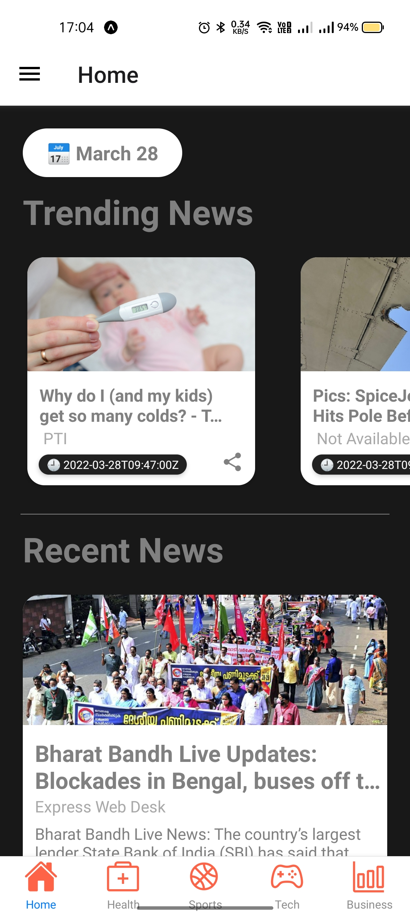
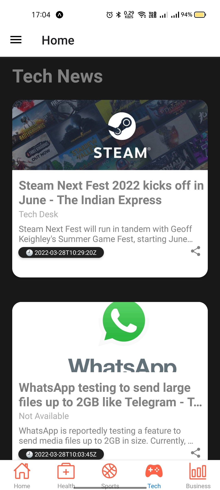
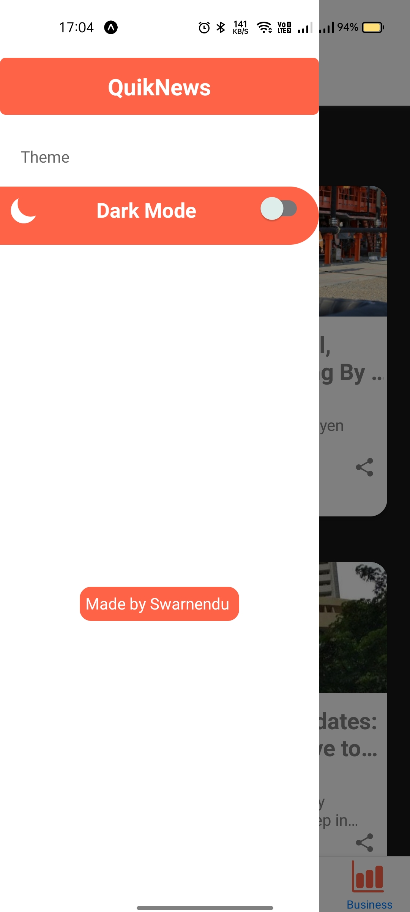
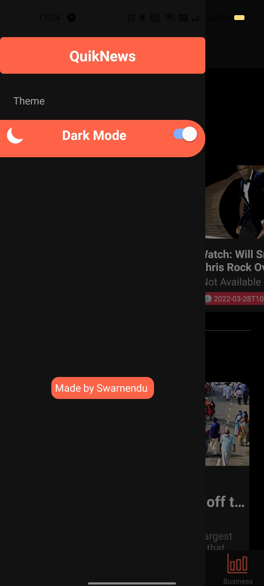

## Overview

QuikNews is a cross platform news application that brings your favourite news to your fingertips in an easy-to-access manner, and it also comes in Dark Mode! Available for iOS and Android.
Developed as a personal project, created using [React Native](https://facebook.github.io/react-native/)


## Screenshot
<p justifyContent="space-between" >
   
   
   
</p>

<p justifyContent="space-between" >
   
   
   
</p>

## Installation

Make sure you have setup react native environment [here](https://reactnative.dev/docs/environment-setup)

Clone this repo

```
$ git clone https://github.com/OtakuKvothe/news-app.git
$ cd news-app
```

Install dependencies

```sh
$ npm install
```

If you're running iOS, make sure you install the pods

```sh
$ cd ios
$ pod install
```

Run android or ios

```
$ npm run android
```

```
$ npm run ios
```

This project was made purely for educational purposes.